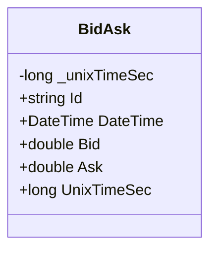
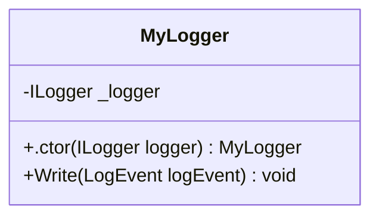
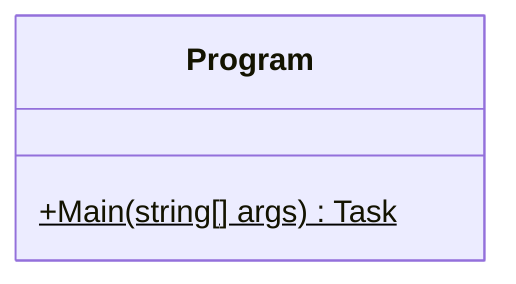

<!-- markdownlint-capture -->
<!-- markdownlint-disable -->

# Code Metrics

This file is dynamically maintained by a bot, *please do not* edit this by hand. It represents various [code metrics](https://aka.ms/dotnet/code-metrics), such as cyclomatic complexity, maintainability index, and so on.

## MyJetWallet.Domain.Candles :heavy_check_mark:

The *MyJetWallet.Domain.Candles.csproj* project file contains:

- 1 namespaces.
- 1 named types.
- 32 total lines of source code.
- Approximately 14 lines of executable code.
- The highest cyclomatic complexity is 2 :heavy_check_mark:.

  <strong id="myjetwallet-domain-candles">
    MyJetWallet.Domain.Candles :heavy_check_mark:
  </strong>

 

The `MyJetWallet.Domain.Candles` namespace contains 1 named types.

- 1 named types.
- 32 total lines of source code.
- Approximately 14 lines of executable code.
- The highest cyclomatic complexity is 2 :heavy_check_mark:.

  <strong id="bidask">
    BidAsk :heavy_check_mark:
  </strong>

 

- The `BidAsk` contains 6 members.
- 29 total lines of source code.
- Approximately 14 lines of executable code.
- The highest cyclomatic complexity is 2 :heavy_check_mark:.

| Member kind | Line number | Maintainability index | Cyclomatic complexity | Depth of inheritance | Class coupling | Lines of source / executable code |
| :-: | :-: | :-: | :-: | :-: | :-: | :-: |
| Field | <a href='https://github.com/MyJetWallet/MyJetWallet.Domain.Candles/blob/master/src/MyJetWallet.Domain.Candles/BidAsk.cs#L9' title='long BidAsk._unixTimeSec'>9</a> | 100 | 0 :heavy_check_mark: | 0 | 0 | 1 / 0 |
| Property | <a href='https://github.com/MyJetWallet/MyJetWallet.Domain.Candles/blob/master/src/MyJetWallet.Domain.Candles/BidAsk.cs#L26' title='double BidAsk.Ask'>26</a> | 100 | 2 :heavy_check_mark: | 0 | 2 | 2 / 2 |
| Property | <a href='https://github.com/MyJetWallet/MyJetWallet.Domain.Candles/blob/master/src/MyJetWallet.Domain.Candles/BidAsk.cs#L23' title='double BidAsk.Bid'>23</a> | 100 | 2 :heavy_check_mark: | 0 | 2 | 2 / 2 |
| Property | <a href='https://github.com/MyJetWallet/MyJetWallet.Domain.Candles/blob/master/src/MyJetWallet.Domain.Candles/BidAsk.cs#L16' title='DateTime BidAsk.DateTime'>16</a> | 97 | 2 :heavy_check_mark: | 0 | 5 | 7 / 4 |
| Property | <a href='https://github.com/MyJetWallet/MyJetWallet.Domain.Candles/blob/master/src/MyJetWallet.Domain.Candles/BidAsk.cs#L12' title='string BidAsk.Id'>12</a> | 100 | 2 :heavy_check_mark: | 0 | 2 | 2 / 2 |
| Property | <a href='https://github.com/MyJetWallet/MyJetWallet.Domain.Candles/blob/master/src/MyJetWallet.Domain.Candles/BidAsk.cs#L29' title='long BidAsk.UnixTimeSec'>29</a> | 98 | 2 :heavy_check_mark: | 0 | 2 | 6 / 4 |

<a href="#BidAsk-class-diagram">:link: to `BidAsk` class diagram</a>

<a href="#myjetwallet-domain-candles">:top: back to MyJetWallet.Domain.Candles</a>

<a href="#myjetwallet-domain-candles">:top: back to MyJetWallet.Domain.Candles</a>

## TestApp :heavy_check_mark:

The *TestApp.csproj* project file contains:

- 1 namespaces.
- 2 named types.
- 44 total lines of source code.
- Approximately 8 lines of executable code.
- The highest cyclomatic complexity is 1 :heavy_check_mark:.

  <strong id="testapp">
    TestApp :heavy_check_mark:
  </strong>

 

The `TestApp` namespace contains 2 named types.

- 2 named types.
- 44 total lines of source code.
- Approximately 8 lines of executable code.
- The highest cyclomatic complexity is 1 :heavy_check_mark:.

  <strong id="mylogger">
    MyLogger :heavy_check_mark:
  </strong>

 

- The `MyLogger` contains 3 members.
- 15 total lines of source code.
- Approximately 3 lines of executable code.
- The highest cyclomatic complexity is 1 :heavy_check_mark:.

| Member kind | Line number | Maintainability index | Cyclomatic complexity | Depth of inheritance | Class coupling | Lines of source / executable code |
| :-: | :-: | :-: | :-: | :-: | :-: | :-: |
| Field | <a href='https://github.com/MyJetWallet/MyJetWallet.Domain.Candles/blob/master/src/TestApp/Program.cs#L42' title='ILogger MyLogger._logger'>42</a> | 100 | 0 :heavy_check_mark: | 0 | 1 | 1 / 0 |
| Method | <a href='https://github.com/MyJetWallet/MyJetWallet.Domain.Candles/blob/master/src/TestApp/Program.cs#L44' title='MyLogger.MyLogger(ILogger logger)'>44</a> | 96 | 1 :heavy_check_mark: | 0 | 2 | 4 / 1 |
| Method | <a href='https://github.com/MyJetWallet/MyJetWallet.Domain.Candles/blob/master/src/TestApp/Program.cs#L49' title='void MyLogger.Write(LogEvent logEvent)'>49</a> | 88 | 1 :heavy_check_mark: | 0 | 3 | 5 / 2 |

<a href="#MyLogger-class-diagram">:link: to `MyLogger` class diagram</a>

<a href="#testapp">:top: back to TestApp</a>

  <strong id="program">
    Program :heavy_check_mark:
  </strong>

 

- The `Program` contains 1 members.
- 25 total lines of source code.
- Approximately 5 lines of executable code.
- The highest cyclomatic complexity is 1 :heavy_check_mark:.

| Member kind | Line number | Maintainability index | Cyclomatic complexity | Depth of inheritance | Class coupling | Lines of source / executable code |
| :-: | :-: | :-: | :-: | :-: | :-: | :-: |
| Method | <a href='https://github.com/MyJetWallet/MyJetWallet.Domain.Candles/blob/master/src/TestApp/Program.cs#L16' title='Task Program.Main(string[] args)'>16</a> | 72 | 1 :heavy_check_mark: | 0 | 3 | 22 / 5 |

<a href="#Program-class-diagram">:link: to `Program` class diagram</a>

<a href="#testapp">:top: back to TestApp</a>

<a href="#testapp">:top: back to TestApp</a>

## Metric definitions

  - **Maintainability index**: Measures ease of code maintenance. Higher values are better.
  - **Cyclomatic complexity**: Measures the number of branches. Lower values are better.
  - **Depth of inheritance**: Measures length of object inheritance hierarchy. Lower values are better.
  - **Class coupling**: Measures the number of classes that are referenced. Lower values are better.
  - **Lines of source code**: Exact number of lines of source code. Lower values are better.
  - **Lines of executable code**: Approximates the lines of executable code. Lower values are better.

## Mermaid class diagrams

##### `BidAsk` class diagram

##### `MyLogger` class diagram

##### `Program` class diagram

*This file is maintained by a bot.*

<!-- markdownlint-restore -->
